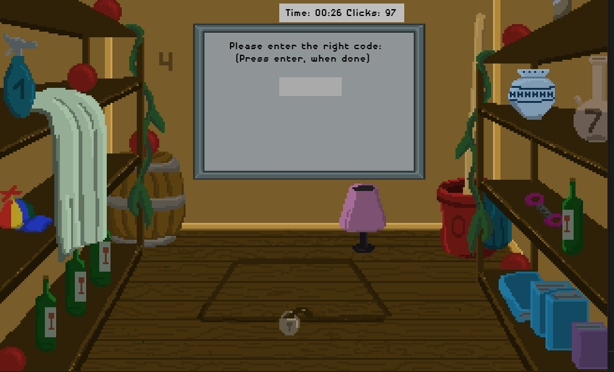

# Escaperoom Adventure - Where is my Emma? 

This project was created as part of the 'Basic Programming in Python' course at the University Osnabrück.
It is based on the concept of an escape room, where you can examine the individual scenes by clicking on the screen. Each scene consists of 1-2 puzzles, only when solve the respective puzzles you can switch to the next scene.
If you manage to solve all the puzzles, you win the game!

CONTENTS OF THIS FILE
---------------------

 - Requirements
 - How to play the game
 - Game structure and solutions
    - The starting screen
    - The big descision
    - Rooms behind door 1
    - Rooms behind door 2
    - Rooms behind door 3
 - The story
 - Sources

REQUIREMENTS
---------------------
Please install pygame.
```bash
pip install pygame
```
or 
```bash
conda install pygame
```
 Please install numpy. 
```bash
pip install numpy
```
or 
```bash
conda install numpy
```
Please install mathplotlib

```bash
pip install mathplotlib
```
or 
```bash
conda install mathplotlib
```

Please install pandas

```bash
pip install pandas
```
or 
```bash
conda install pandas
```
To start the game excecute the 'main.py' file
```bash
python main.py
```

HOW TO PLAY THE GAME
---------------------
In order to solve our puzzles you need to click on something on the screen. Sometimes you find a key, sometimes you find or reveal a part of the puzzle that is needed to solve it.
We hide some hints for you to keep your eyes open, anything can be useful, maybe it helps if you use pen and paper.
If you have the correct code to solve the puzzle you have to either use your keyboard or you have to click on numbers at your screen.

GAME STRUCTURE AND SOLUTIONS
---------------------
BEVORE READING FURTHER... PLEASE PLAY THE GAME FIRST, IN THIS SECTION WE WILL GIVE YOU THE SOLUTIONS!

| Door 1 | Door 2 | Door 3 |
|:--------------|:-------------|:--------------|
| Bathroom | Childsroom | Surprise |
| Backroom | Garden |  |
| Saferoom | Saferoom |  |
| End | End |  |

THE STARTING SCREEN
---------------------
Here you can choose between starting the game or reading the story.


THE BIG DESCISION
---------------------
If you clicked on start, you will end up in this room where you have to decide between 3 doors.
Depending on your choice you will visit different rooms and puzzles.


ROOMS BEHIND DOOR 1
---------------------
The first room will be the bathroom, try to find out what the puzzle could be.

```bash
Try to crack the wall in the middle of the screen by clicking on it.
```

The second room will be the backroom, here you have to find the correct code, if you want to enter the next room.
Be careful, even the most obvious things can sometimes be wrong! Hints might help you.


```bash
You can find the key in the vase on the right-hand side.
```
```bash
The correct number of red balls is 15. Please use your keyboard to enter this number.
```

The last room contains a safe. The code can be found in room 2.

```bash
You can finde the code for the safe in the backroom. It is 1407. This time you have to click on the right numbers on the touchpad.
```

ROOMS BEHIND DOOR 2
---------------------
The first room will be the childsroom, here you have to solve a puzzle that is a little bit harder, it consists of a logic puzzle that needs to be solved in order to enter the next room.

```bash
The puzzle can be found on the table. The solution is 420. 
Please click on the numbers on the wall to find the correct sequence.
```

The next room is the garden, here you can find a key that is needed if you want to enter the last room.
Please keep in mind that the code for the last room is hidden in this room, and that you cannot come back.

```bash
The key can be found in the birdhouse.
```

The last room consists of a safe. The code can be found in room 2.

```bash
You can finde the code for the safe at the fence in the garden. It is 1532.
```

ROOMS BEHIND DOOR 3
---------------------
Surprise!

THE STORY 
---------------------
